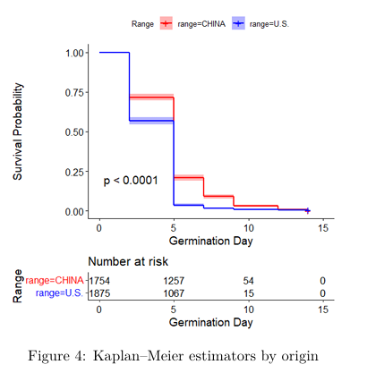
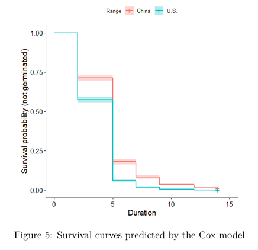
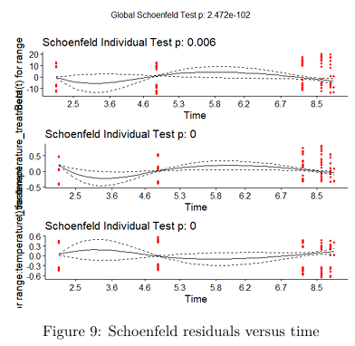

# Germination Dynamics of Native and Non-Native *Ulmus pumila* Populations: A Survival Analysis Approach

## Overview

This project investigates whether invasive (non-native) populations of *Ulmus pumila* (Siberian elm) differ in their germination dynamics compared to native populations.

The study applies classical and modern survival analysis techniques to germination data collected from:

- **China** (native range)
- **United States** (non-native range)

under two temperature treatments:

- **20°C**
- **30°C**

The objective is to determine whether non-native populations germinate faster or more successfully and whether temperature influences this process.

---

## Ecological Motivation

Biological invasions often involve shifts in life-history traits that enhance establishment and spread in novel environments. Germination timing is a critical early-life trait influencing recruitment success and competitive ability. Understanding whether invasive populations of *Ulmus pumila* exhibit altered germination dynamics can provide insight into mechanisms underlying invasion success.

---

## Research Question

> Do non-native populations of *Ulmus pumila* germinate faster or more successfully than native populations, and how is this affected by temperature?

---


## Dataset Description

Each observation corresponds to a seed monitored during a germination experiment.

### Variables

| Variable | Description |
|-----------|------------|
| `seed` | Seed index within each replicate (1–20) |
| `Range` | Geographic origin (`China` or `U.S.`) |
| `Population` | Population identifier |
| `Replicate` | Experimental replicate |
| `Germination_day` | Day of germination |
| `Status` | Event indicator (1 = germinated, 0 = censored) |
| `Temperature_treatment` | Incubation temperature (20°C or 30°C) |

### Censoring

Seeds that failed to germinate during the observation period were treated as **right-censored observations**.

The data exhibit **Type I right censoring**, as censoring occurred at a fixed study endpoint (14 days).

---

## Key Findings

- Higher temperatures accelerated germination.
- U.S. populations generally germinated earlier than Chinese populations.
- Significant differences were detected between origins.
- The proportional hazards assumption was violated.
- A log-logistic AFT model provided the best fit.

---
## Results Snapshot

### Kaplan–Meier Survival Curves



**Key observation:** Survival probabilities declined rapidly for both origins, indicating that most seeds germinated during the study period. U.S. populations generally exhibited lower survival probabilities than Chinese populations, suggesting earlier germination and supporting differences in germination dynamics between native and non-native populations.

### Cox Model Survival Curves



**Key observation:** The fitted Cox model closely reproduced the empirical Kaplan–Meier curves, indicating a good overall fit to the observed germination patterns. Germination timing differed significantly between geographic origins, with range emerging as an important predictor of germination dynamics.

### Schoenfeld Residual Diagnostics



**Key observation:** Schoenfeld residual tests revealed significant time dependence for the model covariates, and the global test strongly rejected the proportional hazards assumption. These results suggest that a standard Cox proportional hazards model may not be fully appropriate for final inference, motivating the use of parametric survival models.

---

## Statistical Methods

The analysis was conducted using survival analysis techniques implemented in R.

### Descriptive Analysis

- Summary statistics of germination time
- Distribution of populations by geographic origin
- Boxplots of germination times

### Non-Parametric Survival Analysis

- Kaplan–Meier survival estimators
- Survival curves by geographic origin
- Survival quantile estimation
- Harrington–Fleming weighted log-rank tests

### Semi-Parametric Analysis

- Cox proportional hazards models
- Hazard ratio estimation
- Likelihood ratio tests
- Proportional hazards diagnostics:
  - Nelson–Aalen plots
  - Time-dependent covariate interactions
  - Schoenfeld residual tests

### Parametric Survival Models

- Log-normal AFT model
- Log-logistic AFT model
- Model selection using AIC

---

## Main Findings

### Kaplan–Meier Analysis

- U.S. populations tended to germinate earlier than Chinese populations.
- Survival curves differed significantly between origins.
- Weighted log-rank tests strongly rejected equality of survival functions.

### Cox Proportional Hazards Model

- Temperature significantly increased germination hazard.
- The interaction between range and temperature was significant.
- The proportional hazards assumption was violated.

### Parametric Modeling

A log-logistic Accelerated Failure Time (AFT) model provided the best fit.

Results indicated:

- Higher temperatures substantially accelerate germination.
- U.S. populations generally germinate earlier.
- The effect of temperature differs between native and non-native populations.

---

## Repository Structure

```text
.
├── survival_analysis.R          # Complete R analysis script
├── data
│   └── germination_data.xlsx    # Raw dataset
├── figures
│   ├── km_by_origin.png         # Kaplan–Meier curves by origin
│   ├── cox_survival_curves.png  # Cox model survival curves
│   └── schoenfeld_residuals.png # PH assumption diagnostics
├── report
│   └── survival_analysis.pdf    # Final report
├── LICENSE
└── README.md
```

---

## Required R Packages

The analysis uses the following packages:

```r
library(readxl)
library(FactoMineR)
library(factoextra)
library(corrplot)
library(psych)
library(survival)
library(survminer)
library(KMsurv)
library(car)
library(dplyr)
library(tidyr)
```

Install missing packages with:

```r
install.packages(c(
  "readxl",
  "FactoMineR",
  "factoextra",
  "corrplot",
  "psych",
  "survival",
  "survminer",
  "KMsurv",
  "car",
  "dplyr",
  "tidyr"
))
```

---

## Running the Analysis

Clone the repository:

```bash
git clone https://github.com/Mateus-Auza/survival-analysis-ulmus-pumila.git
cd survival-analysis-ulmus-pumila
```

Open R or RStudio and run:

```r
source("code/survival_analysis.R")
```

The script imports the dataset, performs all analyses, and generates the figures used in the report.

---

## Results

The complete analysis and interpretation are available in:

```text
report/survival_analysis.pdf
```

Figures generated during the analysis are stored in:

```text
figures/
```
---

## Reproducibility

All analyses are fully reproducible from the raw dataset included in the repository. Running the R script regenerates the statistical analyses and figures presented in the report.

---

## Conclusions

This study provides evidence that germination dynamics differ between native and invasive populations of *Ulmus pumila*. Temperature is the dominant factor influencing germination timing, while population origin modifies the response to temperature. Because the proportional hazards assumption was violated, parametric survival models offered a more appropriate framework than Cox regression for final inference.

---

## Author

**Mateus Auza Cruz**

Completed: December 2025

---

## License

This project is distributed under the terms specified in the `LICENSE` file.
